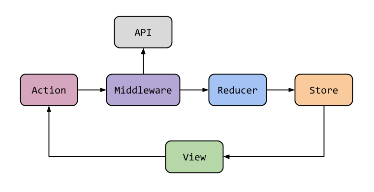

# Nuwe App

Proyecto de reto - [DESCARGAR DEMO](https://drive.google.com/drive/folders/180jt-TSqPQElNoHVzL3pRDzG1T1nJypI?usp=sharing)


## Comenzando 🚀

_Estas instrucciones te permitirán obtener una versión del proyecto en funcionamiento en tu máquina local para propósitos de desarrollo y pruebas._

### Pre-requisitos 📋

#### Tener instalado Flutter

### Instalación 🔧

### instalar dependencias

```
flutter pub get
```

## Ejecutando App ⚙️

### Ejecutar con datos mock (no es necesario integrarlo con Firebase)

```
flutter run --debug -t lib/main_mock.dart
```

#### para su version realase con datos mock

```
flutter run --release -t lib/main_mock.dart
```

### Para los servicios con Firebase descomentar linea 25 en 'android\app\build.gradle' y configurar el archivo google-services.json en la carpeta 'android\app\'


### Ejecutar en modo producción

```
flutter run --release -t lib/main.dart
```

## Build 📦

### Crear el apk

```
flutter build apk -t lib/main.dart
```

## Construido con 🛠️

- [Redux](http://www.dropwizard.io/1.0.2/docs/) - Como manejador de estados para que otros devs que vengan del frontend con React se integren rápido.
- [Rx.dart](https://pub.dev/packages/rxdart) y [Redux_epics](https://pub.dev/packages/redux_epics)- Para manejar los estados en tiempo real.



- [pub](https://maven.apache.org/) - Manejador de dependencias
- [Firebase](https://firebase.google.com/) - Como base de datos y autentificación.
- [DDD](https://en.wikipedia.org/wiki/Domain-driven_design) - como arquitectura de la app para escalar comodamente y alternar entre diferentes fuentes de datos rápidamente.


# SEMANA 2
